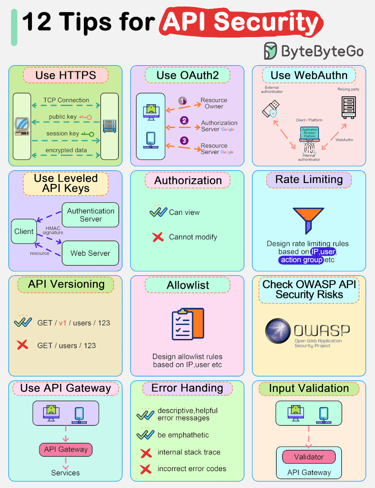
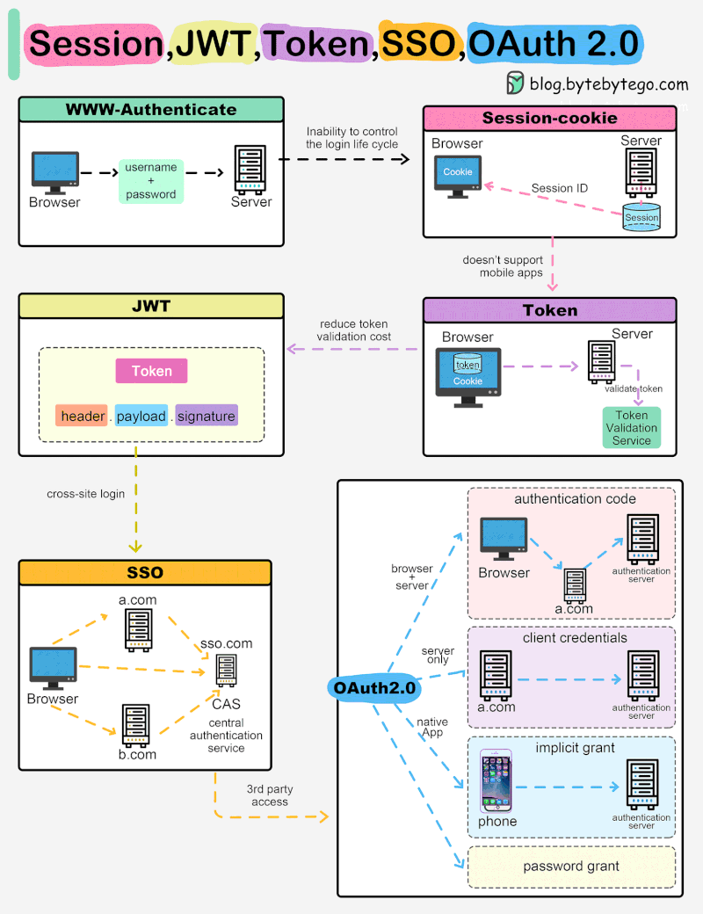

## 🧭 Table of Contents

1. [Java Fundamentals](#i--java-fundamentals)
2. [Java Advanced Topics](#ii--java-advanced-topics)
3. [OOP & Design Patterns](#iii--oop--design-patterns)
4. [Databases](#iv--databases)
5. [Spring Ecosystem](#v--spring-ecosystem)
6. [Microservices Architecture](#vi--microservices-architecture)
7. [CI/CD & DevOps](#vii--cicd--devops)
8. [Cloud Platforms](#viii--cloud-platforms)
9. [Security & Authorization](#ix--security--authorization)
10. [Monitoring & Observability](#x--monitoring--observability)
11. [Others](#xi--others)

---

## I. ☕ Java Fundamentals

- [x] [Java Base](review/src/myjava/docs/Base.md)
- [x] [Collections](review/src/myjava/docs/Collection.md)
- [x] [Stream API](review/src/myjava/docs/Stream.md)
- [ ] File I/O
- [ ] Exception Handling
- [ ] [Multithreading](review/src/myjava/docs/Multithreading.md)
- [ ] Java Memory Management (Stack vs Heap, GC, etc.)
- [ ] Java Annotations
- [ ] Generics & Reflection
- [ ] JUnit/TestNG (Testing)
- [ ] Logging (SLF4J, Logback)
- [ ] Regex
- [ ] Networking

---

## II. ⚙️ Java Advanced Topics

- [ ] Functional Programming (Lambdas, Optional, Method References)
- [ ] CompletableFuture & Concurrency
- [ ] Java Module System
- [ ] Performance Tuning
- [ ] JVM Internals (JIT, Classloader, GC types)
- [ ] Reactive Programming
---

## III. 📦 OOP & Design Patterns

- [ ] SOLID Principles
- [ ] OOP với Java
- [ ] Common Design Patterns:
    - Singleton, Factory, Strategy, Observer, etc.

---

## IV. 🗃️  Databases

### 1. Relational
- [ ] SQL cơ bản & nâng cao
- [ ] JDBC
- [ ] JPA/Hibernate
- [ ] Transaction Management

### 2. NoSQL
- [ ] MongoDB
- [ ] Redis

---

## V. 🍃  Spring Ecosystem

### 1. Spring Core
- [ ] Dependency Injection
- [ ] Bean Lifecycle

### 2. Spring Boot
- [ ] Auto Configuration
- [ ] Properties & Profiles

### 3. Spring Data
- [ ] Spring Data JPA
- [ ] MyBatis (option)

### 4. Spring Security
- [x] [Security Overview](template/Security/security.md)
- [x] [Authentication](template/Security/AuthenticationWay.md)
- [x] [REST API](template/spring-security-restful/ReadMe.md)
- [x] [OAuth2](template/Security/OAuth/ReadMe.md)

### 5. Spring AOP
- [x] [Spring AOP](review/src/spring/springAOP.md)

### 6. Spring Web (MVC + REST)
- [x] [Thymeleaf](template/spring-security-thymeleaf/ReadMe.md)

### 7. Spring Cloud 🍂
- [ ] Eureka
- [ ] API Gateway
- [ ] Config Server
- [ ] Resilience4j / Circuit Breaker

### 8. Reactive
- [ ] Spring WebFlux

### 9. Communication
- [x] [gRPC](template/spring-gRPC/ReadMe.md)
- [x] [GraphQL](template/spring-graphql/src/main/resources/static/doc/GraphQL.md)

---

## VI. 🧩 Microservices Architecture

- [ ] Microservices communication (REST, gRPC, Messaging)
- [ ] API Gateway
- [ ] Service Discovery
- [ ] Config & Centralized Logging
- [ ] Distributed Tracing (Zipkin, Sleuth)
- [ ] Kafka, RabbitMQ

---

## VII. 🚀 CI/CD & DevOps

- [x] [Git](review/src/git/Git.md)
- [x] [Docker](review/src/deploy/docs/Docker.md)
- [x] [Jenkins](review/src/deploy/docs/Jenkins.md)
- [ ] Docker Compose
- [ ] Kubernetes ☸️
- [ ] Helm
- [ ] Terraform (Infrastructure as Code)

---

## VIII. ☁️ Cloud Platforms

- [ ] AWS 
- [ ] Azure
- [ ] Google Cloud (GCP)

---

## IX. 🔐 Security & Authorization

- [ ] JWT, Refresh Token
- [ ] CSRF, CORS
- [ ] RBAC, ABAC (Casbin)
- [ ] OWASP Top 10

---

## X. 🔎 Monitoring & Observability

- [ ] Micrometer
- [ ] Prometheus & Grafana
- [ ] ELK stack (Elasticsearch, Logstash, Kibana)
- [ ] OpenTelemetry

---

## XI. 📚 Others

- [x] [Internet cơ bản](restful-spring/docs/BaseInternet.md)
- [ ] Elastic Search
- [ ] Flyway (DB versioning)
- [ ] JMix (Low-code Java Platform)

---

## XII. 🧪 Dự án thực hành đề xuất

- E-Commerce REST API (Spring Boot + JWT + JPA)
- Social Network mini
- Chat app realtime (WebSocket + Redis)
- Portfolio microservice (cho GitHub cá nhân)

| [👩🏻‍💻 to be Expert](review/src/blog/tobeExpert.md)                       | [↑ 𓂃🖊 ](#-table-of-contents) |
|:----------------------------------------------------------------------------|:-------------------------------|