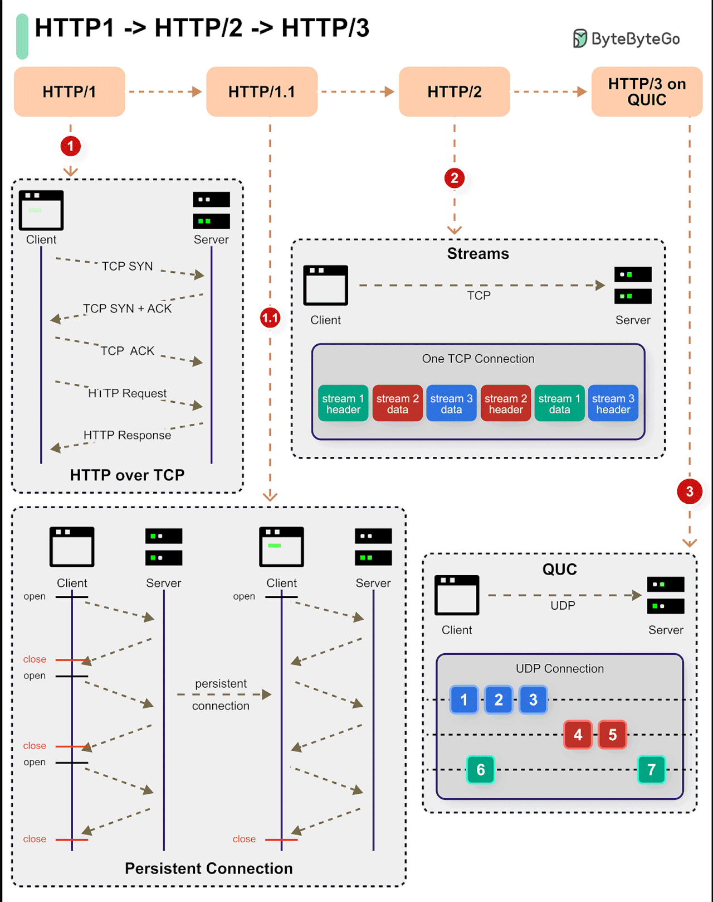

📌 So sánh Tomcat với các Application Server khác (Netty, Jetty, Undertow, WildFly,...)

|Tiêu chí| Tomcat                    | Netty             | Jetty| Undertow|	WildFly (JBoss)|
| :--- |:--------------------------|:------------------| :-- | :-- | :-- | 
|Mô hình| 	Servlet Container        | 	Async Event-Driven|	Servlet Container|	Servlet + Async|	Java EE Application Server|
|Giao thức| 	HTTP/1.1, WebSocket      |	HTTP/2, TCP, WebSocket|	HTTP/1.1, HTTP/2|	HTTP/1.1, HTTP/2|	HTTP, JMS, EJB, etc.|
|Hỗ trợ gRPC| 	❌ Không hỗ trợ HTTP/2 gốc|	✅ Hỗ trợ HTTP/2 gốc	|⚠️ Có thể hỗ trợ với ALPN|	✅ Hỗ trợ HTTP/2 gốc|	⚠️ Có thể hỗ trợ qua Undertow|
|Blocking/Non-Blocking|	Blocking	|Non-Blocking|	Blocking & Non-Blocking|	Non-Blocking|	Blocking & Non-Blocking|
|Hiệu suất|	🟠 Trung bình	|🟢 Cao (async, lightweight)|	🟡 Trung bình|	🟢 Cao (nhẹ, async)	|🔴 Nặng (full-stack Java EE)|
|Dễ sử dụng|	✅ Dễ setup	|⚠️ Cần custom config	|✅ Dễ setup	|✅ Dễ setup	|❌ Khó, phức tạp|
|Dùng phổ biến trong|	REST API, MVC App	|Microservices, gRPC, WebSocket	|REST API, Embedded Server|	Microservices, REST API	|Enterprise Apps (EJB, JMS)|

# 📌 Mô hình OSI và các giao thức theo từng tầng

Mô hình OSI gồm **7 tầng**, mỗi tầng có các giao thức riêng. Dưới đây là danh sách các giao thức phổ biến theo từng tầng:

## 🔹 Bảng tổng hợp các giao thức theo tầng OSI

| **Tầng (Layer)**      | **Chức năng**                            | **Giao thức phổ biến**                  |
|----------------------|--------------------------------|----------------------------------|
| **7. Application** *(Ứng dụng)*    | Giao tiếp với người dùng & ứng dụng  | HTTP, HTTPS, FTP, SMTP, POP3, IMAP, WebSocket, gRPC, MQTT |
| **6. Presentation** *(Trình diễn)*  | Mã hóa, nén dữ liệu                 | SSL/TLS, ASCII, JPEG, PNG, MPEG |
| **5. Session** *(Phiên làm việc)*    | Quản lý phiên kết nối                | NetBIOS, RPC, SOCKS |
| **4. Transport** *(Vận chuyển)*     | Truyền dữ liệu giữa 2 hệ thống       | TCP, UDP, QUIC |
| **3. Network** *(Mạng)*             | Định tuyến dữ liệu                   | IP, ICMP, ARP, BGP, OSPF |
| **2. Data Link** *(Liên kết dữ liệu)*| Kết nối giữa 2 thiết bị              | Ethernet, PPP, MAC, VLAN, Wi-Fi (802.11) |
| **1. Physical** *(Vật lý)*           | Truyền tín hiệu điện/từ              | RJ-45, Fiber Optic, Bluetooth, USB, 4G/5G |

---

## 🔹 Giải thích chi tiết từng tầng

### **1️⃣ Tầng Vật lý (Physical Layer)**
- **💡 Chức năng:** Truyền tín hiệu điện, quang, radio.
- **📌 Giao thức & công nghệ:** Cáp quang, Wi-Fi, Bluetooth, 4G/5G, Ethernet.

### **2️⃣ Tầng Liên kết Dữ liệu (Data Link Layer)**
- **💡 Chức năng:** Chuyển dữ liệu giữa 2 thiết bị trong cùng mạng LAN.
- **📌 Giao thức:** Ethernet, MAC, Wi-Fi (802.11), PPP, VLAN.

### **3️⃣ Tầng Mạng (Network Layer)**
- **💡 Chức năng:** Định tuyến dữ liệu giữa các mạng.
- **📌 Giao thức:**
    - **IP (Internet Protocol)**: Định địa chỉ IP, chuyển tiếp gói tin.
    - **ICMP** (ping, kiểm tra kết nối).
    - **ARP** (chuyển đổi IP ↔ MAC).
    - **BGP, OSPF** (định tuyến).

### **4️⃣ Tầng Vận chuyển (Transport Layer)**
- **💡 Chức năng:** Đảm bảo dữ liệu truyền đi đúng thứ tự & không bị mất.
- **📌 Giao thức:**
    - **TCP (Transmission Control Protocol)**: Kết nối tin cậy, kiểm tra lỗi.
    - **UDP (User Datagram Protocol)**: Nhanh, không đảm bảo dữ liệu.
    - **QUIC**: Nâng cấp từ UDP, hỗ trợ HTTP/3.

### **5️⃣ Tầng Phiên (Session Layer)**
- **💡 Chức năng:** Quản lý phiên kết nối giữa hai máy tính.
- **📌 Giao thức:** NetBIOS, RPC, SOCKS.

### **6️⃣ Tầng Trình diễn (Presentation Layer)**
- **💡 Chức năng:** Mã hóa, nén dữ liệu.
- **📌 Giao thức:**
    - **SSL/TLS** (bảo mật HTTPS).
    - **JPEG, PNG, MPEG** (định dạng dữ liệu).

### **7️⃣ Tầng Ứng dụng (Application Layer)**
- **💡 Chức năng:** Giao tiếp với người dùng & ứng dụng.
- **📌 Giao thức:**
    - **HTTP/HTTPS** (Web).
    - **FTP** (truyền file).
    - **SMTP, IMAP, POP3** (email).
    - **WebSocket** (kết nối real-time).
    - **gRPC, MQTT** (truyền dữ liệu nhanh).

---

## 🔹 So sánh TCP và UDP

| **Tiêu chí**   | **TCP** | **UDP** |
|---------------|--------|--------|
| **Kết nối**   | Có (reliable) | Không (connectionless) |
| **Tốc độ**    | Chậm hơn do kiểm tra lỗi | Nhanh hơn |
| **Độ tin cậy** | Đảm bảo gửi đúng thứ tự | Không đảm bảo |
| **Dùng cho**  | Web, email, SSH | Video call, game online |

---

## HTTP history

[🏠](https://github.com/DongNguyen20/lib-spring/blob/feature/lib-docs/List%20Contents.md)

---
[↩ 🏠︎ Home : ̗̀➛](../../List Contents.md)