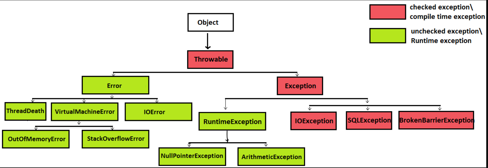

# Unit Test

##  ⭐ JaCoCo

#### 1. Config Maven in `pom.xml`
```xml
<build>
    <plugins>
        <!-- Plugin JaCoCo -->
        <plugin>
            <groupId>org.jacoco</groupId>
            <artifactId>jacoco-maven-plugin</artifactId>
            <version>0.8.12</version>
            <executions>
                <execution>
                    <goals>
                        <goal>prepare-agent</goal>
                    </goals>
                </execution>
                <!-- Tạo báo cáo sau khi kiểm tra -->
                <execution>
                    <id>report</id>
                    <phase>test</phase>
                    <goals>
                        <goal>report</goal>
                    </goals>
                </execution>
            </executions>
        </plugin>
    </plugins>
</build>
```
### 2. Run Maven to generate report
``mvn clean test``

_**Report**_: _`target\site\jacoco\index.html`_ 

### 3. Setting in Intellij

