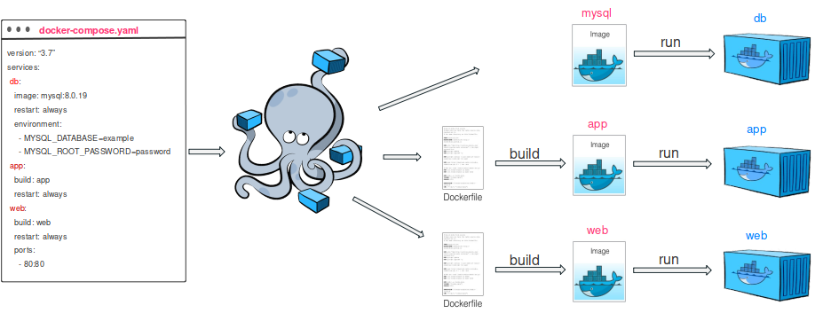

# Docker

**What?**: Docker is an open platform for developing, shipping, and running applications. Docker enables you to separate your applications from your infrastructure so you can deliver software quickly.

## Introduction
### Run first container
`docker run -d -p 8080:80 docker/welcome-to-docker`
Giải thích:

- docker run:
_Lệnh docker run được sử dụng để tạo và chạy một container từ một Docker image._
- -d (detached mode):
_Tham số -d chạy container ở chế độ "detached", nghĩa là container sẽ chạy ở nền (background) và không chiếm terminal hiện tại của bạn. Điều này rất hữu ích khi bạn muốn container chạy liên tục mà không phải tương tác với nó ngay lập tức._
- -p 8080:80 (port mapping):
  + Tham số -p dùng để ánh xạ (map) cổng của container với cổng của máy chủ (host machine).
  + 8080:80: Có nghĩa là ánh xạ cổng 8080 của máy chủ (host) với cổng 80 của container.
Cổng 80 thường là cổng mặc định cho các ứng dụng web (HTTP) trong container (ví dụ, Nginx, Apache).
Khi truy cập http://localhost:8080 trên máy tính, trình duyệt sẽ kết nối với cổng 80 của container.
- docker/welcome-to-docker:
_Đây là tên của Docker image được sử dụng để tạo container. Image này chứa một ứng dụng cơ b_

## Container và Image Docker
- **Image**: Là một bản sao tĩnh của ứng dụng, chứa mã nguồn và mọi thứ cần thiết để chạy ứng dụng.
- **Container**: Là môi trường chạy ứng dụng dựa trên Image.

  
### Mối tương quan:
- **Dockerfile**  ➜ tạo **Docker Image** ➜ Chạy thành **Containers**
- **Docker Compose**: Quản lý nhiều containers (ứng dụng + dịch vụ) từ nhiều **Docker Images**.
## DockerHub 
created Repository

## Command
### images
- List:   `docker image ls `
- Pull:   `docker pull [image_name]`
- Build:  `docker build -t [image_name] .`
- Delete: `docker rmi [image_id_or_name]`
### containers
- List running: `docker ps` 
- List all: `docker ps -a`
- Run a container from image: `docker run [image_name]`
- Run with detached mode: `docker run -d [image_name]`
- Run with port: `docker run -p [host_port:container_port] [image_name]`
- Stop: `docker stop [container_id_or_name]`
- Start: `docker start [container_id_or_name]`
- Delete: `docker rm [container_id_or_name]`
- Kill: `docker kill [container_id_or_name]`

## volumes
- List: `docker volume ls`
- Create: `docker volume create [volume_name]`
- Delete: `docker volume rm [volume_name]`

# compose
- Chạy tất cả containers được định nghĩa trong _**docker-compose.yml**_:
`docker-compose up`
  
- Dừng, xóa contatiners tạo bởi Docker Compose
`docker-compose down`
  
- Build lại các images trong file _**docker-compose.yml**_
`docker-compose build`
  
## others
- log: `docker logs [container_id_or_name]`
- detail info: `docker inspect [container_id_or_name]`
- execute statement in container: `docker exec -it [container_id_or_name] [command]`


## Deploy Spring Application 
1. Config `Dockerfile`

```dockerfile
# Base image với Java 17
FROM openjdk:17-jdk-alpine

# Thiết lập thư mục làm việc bên trong container
WORKDIR /app

ARG JAR_FILE=target/*.jar
# Sao chép file JAR của ứng dụng vào container
COPY ${JAR_FILE} /app.jar

# Mở cổng 8080 để ứng dụng Spring Boot có thể nhận yêu cầu HTTP
EXPOSE 8080

# Khởi động ứng dụng Spring Boot
ENTRYPOINT ["java", "-jar", "/app.jar"]
```

2. Config `Docker Compose`
- .`env` file:
```properties
DB_USERNAME=myuser
DB_PASSWORD=mypassword
```
- `docker-compose.yml` file:
```yaml
version: '3'
services:
  app:
    build: .
    ports:
      - "8080:8080"
    env_file:
      - .env
    depends_on:
      - db

  db:
    image: postgres:12
    environment:
      POSTGRES_DB: mydb
      POSTGRES_USER: ${DB_USERNAME}
      POSTGRES_PASSWORD: ${DB_PASSWORD}
    ports:
      - "5432:5432"

  redis:
    image: redis:6
    ports:
      - "6379:6379"
```

3. Push code to Github

4. Setting Jenkins

- Cài Jenkins trên EC2 :
  + Cài các plugin: Docker, GitHub, Pipeline.
- Tạo Pipeline , `Jenkinsfile` file:
```groovy
pipeline {
    agent any

    environment {
        DOCKER_REGISTRY = 'your-dockerhub-username'
        DOCKER_IMAGE = "${DOCKER_REGISTRY}/springboot-app"
        AWS_CREDENTIALS_ID = 'aws-credentials' // Jenkins credential ID
    }

    stages {
        stage('Clone repository') {
            steps {
                git url: 'https://github.com/your-username/your-repo.git', branch: 'main'
            }
        }

        stage('Build JAR') {
            steps {
                sh 'mvn clean package'
            }
        }

        stage('Build Docker Image') {
            steps {
                sh 'docker build -t ${DOCKER_IMAGE}:latest .'
            }
        }

        stage('Push Docker Image') {
            steps {
                withCredentials([string(credentialsId: 'dockerhub-password', variable: 'DOCKERHUB_PASS')]) {
                    sh 'echo $DOCKERHUB_PASS | docker login -u ${DOCKER_REGISTRY} --password-stdin'
                    sh 'docker push ${DOCKER_IMAGE}:latest'
                }
            }
        }

        stage('Deploy to AWS ECS') {
            steps {
                withAWS(credentials: "${AWS_CREDENTIALS_ID}", region: 'us-east-1') {
                    sh 'ecs-cli compose --file docker-compose.yml up'
                }
            }
        }
    }

    post {
        always {
            cleanWs()
        }
    }
}
```

5. Run Docker Compose
   
   ⠀⠀⠀⠀⠀⠀⠀⠀⠀⠀⠀⠀⠀⠀⠀⠀⢀⣀⣀⣀⠀⠀⠀⠀⠀⠀⠀⠀⠀⠀
   ⠀⠀⠀⠀⠀⠀⠀⠀⠀⠀⠀⠀⠀⠀⠀⠀⢸⣿⣿⣿⠀⠀⠀⠀⠀⠀⠀⠀⠀⠀
   ⠀⠀⠀⠀⠀⠀⠀⠀⠀⠀⠀⠀⠀⠀⠀⠀⠘⠛⠛⠛⠀⠀⠀⠀⠀⠀⠀⠀⠀⠀
   ⠀⠀⠀⠀⠀⠀⢰⣶⣶⣶⠀⣶⣶⣶⣶⠀⢰⣶⣶⣶⠀⠀⠀⠀⠀⠀⠀⠀⠀⠀
   ⠀⠀⠀⠀⠀⠀⢸⣿⣿⣿⠀⣿⣿⣿⣿⠀⢸⣿⣿⣿⠀⠀⠀⠀⠀⠀⠀⠀⠀⠀
   ⠀⢠⣤⣤⣤⠀⢠⣤⣤⣤⠀⣤⣤⣤⣤⠀⢠⣤⣤⣤⠀⣰⣿⣿⣦⡀⠀⠀⠀⠀
   ⠀⢸⣿⣿⣿⠀⢸⣿⣿⣿⠀⣿⣿⣿⣿⠀⢸⣿⣿⣿⠀⣿⣿⠹⣿⣷⣀⠀⠀⠀
   ⠀⠘⠛⠛⠛⠀⠘⠛⠛⠛⠀⠛⠛⠛⠛⠀⠘⠛⠛⠛⢀⣿⣿⡀⠙⠿⠿⣿⣶⣆
   ⣴⣶⣶⣶⣶⣶⣶⣶⣶⣶⣶⣶⣶⣶⣶⣶⣶⣶⣶⣿⣿⣿⠟⢁⣤⣴⣶⣾⡿⠋
   ⣿⣿⣿⣛⣛⣛⣛⣿⣟⣛⣛⣻⣿⣟⣛⣛⣻⣿⣟⣋⣉⣠⣤⣾⣿⣟⣻⣍⠀⠀
   ⢹⣿⣿⣀⣀⣀⣀⣀⣀⣀⣀⠀⠀⠀⠀⠀⠀⠀⠀⠀⣠⣾⣿⣿⠋⠀⠀⠀⠀⠀
   ⠈⢻⣿⣿⣿⡿⠿⠿⠿⠛⠉⠀⠀⠀⠀⠀⢀⣠⣴⣿⣿⣿⠟⠁⠀⠀⠀⠀⠀⠀
   ⠀⠀⠙⢿⣿⣿⣶⣦⣤⣤⣤⣤⣤⣴⣶⣿⣿⣿⣿⠟⠋⠁⠀⠀⠀⠀⠀⠀⠀⠀
   ⠀⠀⠀⠀⠈⠙⠛⠛⠿⠿⠿⠿⠿⠛⠛⠛⠉⠁⠀⠀⠀⠀