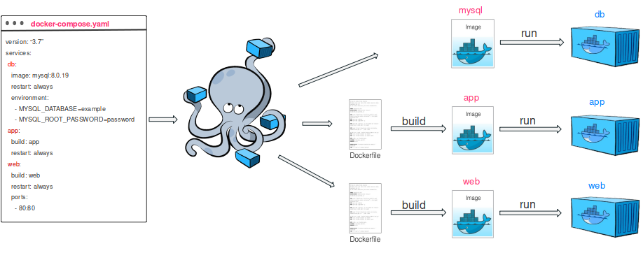

# Docker

**What?**: Docker is an open platform for developing, shipping, and running applications. Docker enables you to separate your applications from your infrastructure so you can deliver software quickly.

## Introduction
### Run first container
`docker run -d -p 8080:80 docker/welcome-to-docker`
Giải thích:

- docker run:
_Lệnh docker run được sử dụng để tạo và chạy một container từ một Docker image._
- -d (detached mode):
_Tham số -d chạy container ở chế độ "detached", nghĩa là container sẽ chạy ở nền (background) và không chiếm terminal hiện tại của bạn. Điều này rất hữu ích khi bạn muốn container chạy liên tục mà không phải tương tác với nó ngay lập tức._
- -p 8080:80 (port mapping):
  + Tham số -p dùng để ánh xạ (map) cổng của container với cổng của máy chủ (host machine).
  + 8080:80: Có nghĩa là ánh xạ cổng 8080 của máy chủ (host) với cổng 80 của container.
Cổng 80 thường là cổng mặc định cho các ứng dụng web (HTTP) trong container (ví dụ, Nginx, Apache).
Khi truy cập http://localhost:8080 trên máy tính, trình duyệt sẽ kết nối với cổng 80 của container.
- docker/welcome-to-docker:
_Đây là tên của Docker image được sử dụng để tạo container. Image này chứa một ứng dụng cơ b_

## Container và Image Docker
- **Image**: Là một bản sao tĩnh của ứng dụng, chứa mã nguồn và mọi thứ cần thiết để chạy ứng dụng.
- **Container**: Là môi trường chạy ứng dụng dựa trên Image.

  
DockerHub 
created Repository
