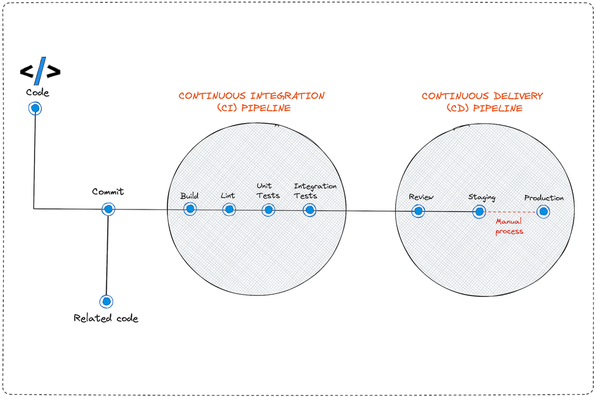
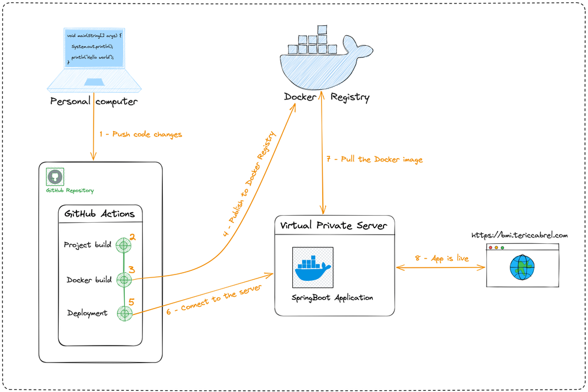

 
_Jenkins là một công cụ tích hợp liên tục (Continuous Integration - CI) và triển khai liên tục (Continuous Deployment - CD) phổ biến, được sử dụng để tự động hóa quá trình phát triển phần mềm._ 

## I. Setup ⚙️

### 1. Docker 🐳

#### a. Docker-compose.yml

```yaml
version: '3'
services:
  jenkins:
    image: jenkins/jenkins:lts
    ports:
      - "8989:8080"
      - "50000:50000"
    volumes:
      - ./jenkins_home:/var/jenkins_home
```
#### b. Command line
- pull jenkins image
  
    `docker pull jenkins/jenkins:lts`

- move to folder `my-jenkins`
- run 

    ```
    docker run -d --name jenkins -p [pc_port]:8080 -p 50000:50000 -v /my-jenkins/jenkins_home:/var/jenkins_home jenkins/jenkins:lts
    ```
  
- get password: 
`docker exec jenkins cat /var/jenkins_home/secrets/initialAdminPassword`
  

### 2. Download ⬇️

_**link**: https://www.jenkins.io/download/_

## II. CI/CD ♾️



### 1. Cấu hình job
- **Freestyle Project**: Cấu hình đơn giản cho các job cơ bản.
- **Pipeline**: Sử dụng DSL (Domain Specific Language) để định nghĩa quy trình làm việc phức tạp.

### 2. 