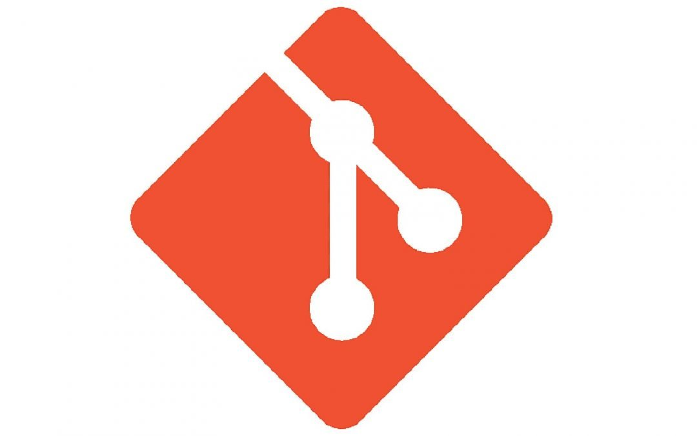
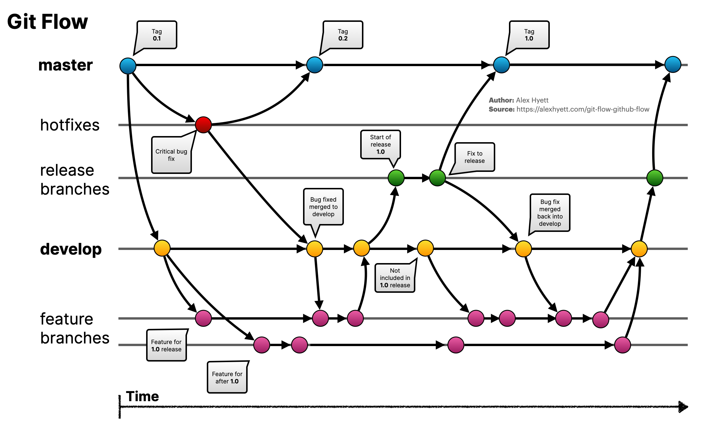

# About Git

## I. Git

`Git` là một hệ thống quản lý mã nguồn phân tán (Distributed Version Control System - DVCS). Nó cho phép nhiều người cùng làm việc trên mã nguồn mà không gây ra xung đột và lưu lại lịch sử toàn bộ quá trình phát triển.

_Ưu điểm của Git:_
- Phân tán: Mỗi người có bản sao đầy đủ của mã nguồn trên máy.
- Theo dõi lịch sử: Mỗi thay đổi đều được ghi lại trong lịch sử.
- Branching nhanh và dễ: Tạo và quản lý nhánh đơn giản.
- Khả năng làm việc offline: Bạn có thể làm việc cục bộ và đồng bộ hóa sau.

### 1. Các khái niệm cơ bản trong Git
- **Repository** (Repo): _Nơi chứa mã nguồn và lịch sử commit._
- **Commit**: _Bản ghi của các thay đổi mã nguồn._
- **Branch**: _Nhánh trong Git, giúp làm việc trên các tính năng độc lập._
- **Merge**: _Hợp nhất các nhánh với nhau._
- **Rebase**: _Dời lịch sử commit của nhánh này lên đầu của nhánh khác._
- **Remote Repository**: _Kho chứa từ xa (như GitHub, GitLab)._
- **Staging Area**: _Vùng tạm để chuẩn bị các file trước khi commit._
- **Working Directory**: _Thư mục chứa mã nguồn trên máy bạn đang làm việc._

### 2. Quy trình

#### a. simple

#### b. teams

## II. Repositories
### 1. GitHub

### 2. GitLab

---
[↩ 🏠︎ Home : ̗̀➛](../../../List Contents.md)