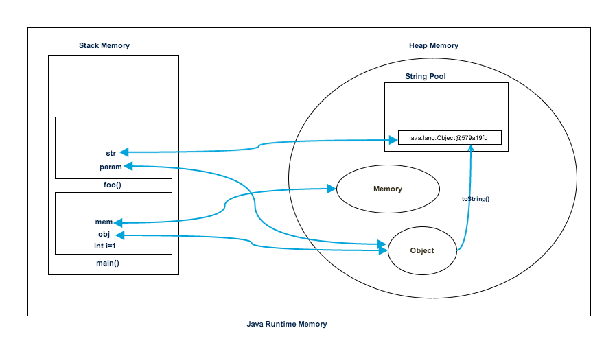
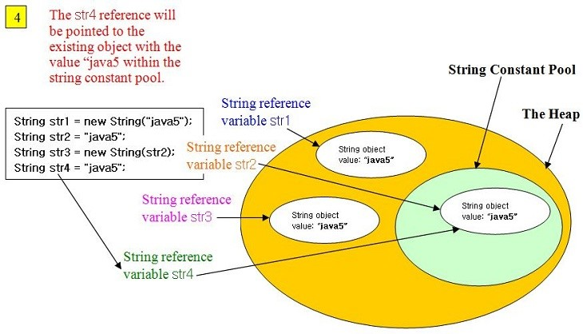

# Memory 💿

|**Stack Mempory**| **Heap Memmory** |
| :---| :---|
|Lưu trữ các biến local trong hàm và lời gọi hàm ở runtime trong một Thread java.|Lưu các Objects|
|Thời gian sống của bộ nhớ Heap dài hơn so với Stack.Thời gian sống của object phụ thuộc vào Garbage Collection của java|Life is short|
|Các objects trong Heap đều được truy cập bởi tất cả các các nơi trong ứng dụng, bởi các threads khác nhau| Sử dụng bởi 1 Thread duy nhất|
|Cơ chế quản lý của Heap thì phức tạp hơn. Heap được phân làm 2 loại Young-Generation, Old-Generation| Cơ chế hoạt động là LIFO (Last-In-First-Out)|
|Dung lượng Heap thường lớn hơn Stack|Bộ nhớ stack thường nhỏ|

### String, StringBuilder, StringBuffer
