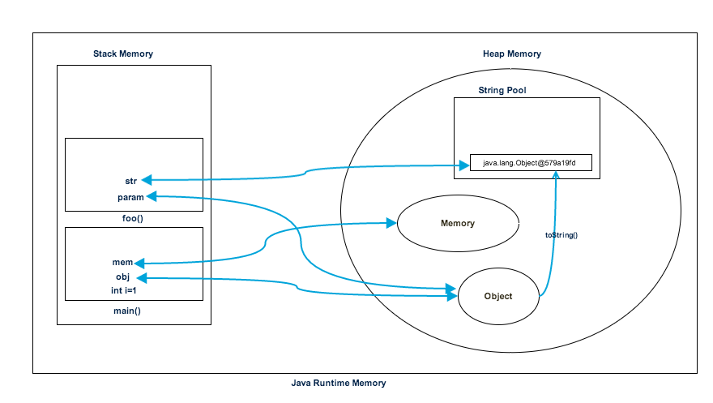
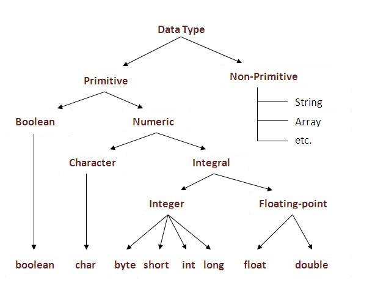
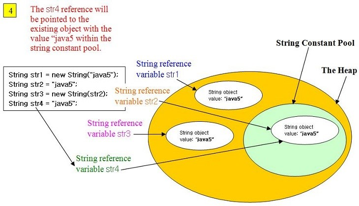

## 1. Memory 💿

#### 📊 Bảng So Sánh Bộ Nhớ Stack và Heap trong Java

| Tiêu chí                     | **Stack Memory**                                      | **Heap Memory**                                       |
|-----------------------------|--------------------------------------------------------|--------------------------------------------------------|
| 📦 **Lưu trữ cái gì?**        | Biến cục bộ, tham số hàm, lời gọi method             | Các object (được tạo bằng `new`), biến instance       |
| 🧠 **Quản lý bởi**            | JVM, tự động theo cấu trúc LIFO                      | JVM, do Garbage Collector quản lý                    |
| ⚡ **Tốc độ**                 | Nhanh hơn (vì quản lý đơn giản)                      | Chậm hơn do quản lý phức tạp                         |
| 🔁 **Phạm vi sống**           | Biến sẽ bị xóa sau khi method kết thúc               | Tồn tại cho đến khi không còn tham chiếu              |
| 📏 **Kích thước**             | Nhỏ hơn Heap                                         | Lớn hơn Stack                                         |
| 🚫 **Lỗi thường gặp**         | `StackOverflowError` (gọi đệ quy vô hạn)             | `OutOfMemoryError` (không đủ bộ nhớ Heap)             |
| 🔄 **Chia sẻ dữ liệu**        | Không (chỉ trong method hiện tại)                   | Có (các method khác có thể truy cập cùng object)     |
| 🛠️ **Cấp phát**               | Tĩnh (fixed khi gọi method)                         | Động (qua `new`)                                     |
| ✅ **Dọn dẹp**                | Tự động khi method kết thúc                         | GC (Garbage Collector) dọn khi object không dùng nữa |
| 🧪 **Ví dụ lưu trữ**          | `int x = 5;`                                        | `Person p = new Person();`                           |

### 2. DataType

### 3. String, StringBuilder, StringBuffer

### 4. Scanner

### 5. OOP

---
[↩ 🏠︎ Home : ̗̀➛](../../../../List%20Contents.md)
