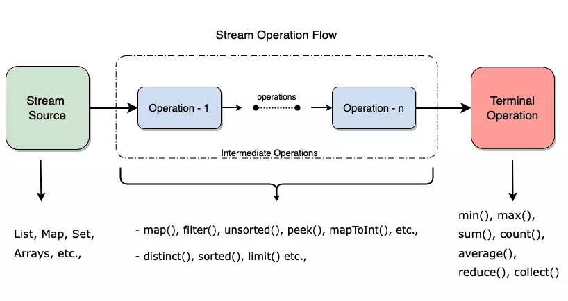

# Stream
**What?** 🤔: 
- Stream trong Java là một trình tự các phần tử được tính toán dựa trên yêu cầu, không lưu trữ dữ liệu mà xử lý chúng 
  thông qua các hoạt động pipeline (chuỗi các bước xử lý).
- Stream không thay đổi nguồn dữ liệu gốc (non-mutating), tức là không làm thay đổi collection, array hoặc source của stream.
- Stream có thể được xử lý song song (parallel) để tận dụng tối đa hiệu suất xử lý đa luồng

### 1. Các loại Stream
```
Stream<T>   (Generic Stream for Objects):
   |
   ├── IntStream      (Stream for int values)
   ├── LongStream     (Stream for long values)
   └── DoubleStream   (Stream for double values)
   📍 method: sum(), average(), max(), min()
```
_Đặc điểm: Tối ưu hiệu suất: để tránh chi phí của boxing/unboxing khi làm việc với dữ liệu nguyên thủy._ 
### 2. Các hoạt động trên Stream
#### a. Hoạt động trung gian(Intermediate Operations)
- [1] : `filter(Predicate)`
- [2] : `map(Function)`
- [3] : `sorted()`
- [4] : `limit(long n)`
- [5] : `skip(long n)`
#### b. Hoạt động kết thúc(Terminal Operations)
- [1] : `forEach(Consumer)`
- [2] : `collect(Collector`
- [3] : `reduce(BinaryOperator)`
  
  ex:
  ```java
  List<Integer> numbers = Arrays.asList(1, 2, 3, 4);
  int sum = numbers.stream().reduce(0, Integer::sum); //10
  ```
- [4] : `count()`
- [5] : `anyMatch(Predicate)`, `allMatch(Predicate)`, `noneMatch(Predicate)`
#### c. Hoạt động ngắn mạch(Short-circuit Operations)
`findFirst(), findAny(), anyMatch()`
### 3. Parallel Stream
```java
List<Integer> numbers = Arrays.asList(1, 2, 3, 4, 5);
numbers.parallelStream().forEach(System.out::println);
```
### 4. Tạo Stream ⚙️
#### a. Collection
```java
List<String> names = Arrays.asList("Alice", "Bob", "Charlie");
Stream<String> nameStream = names.stream();
```
#### b. Array
```java
String[] nameArray = {"Alice", "Bob", "Charlie"};
Stream<String> nameStream = Arrays.stream(nameArray);
```
#### c. Stream.of()
#### d. File
```java
Stream<String> lines = Files.lines(Paths.get("data.txt"));
```
#### e. Vô hạn
```java
Stream<Integer> infiniteStream = Stream.iterate(0, n -> n + 2);
```