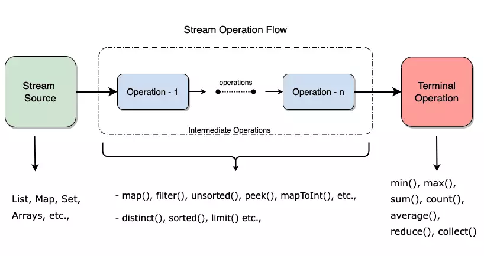

# Stream
**What?** 🤔: 
- Stream trong Java là một trình tự các phần tử được tính toán dựa trên yêu cầu, không lưu trữ dữ liệu mà xử lý chúng 
  thông qua các hoạt động pipeline (chuỗi các bước xử lý).
- Stream không thay đổi nguồn dữ liệu gốc (non-mutating), tức là không làm thay đổi collection, array hoặc source của stream.
- Stream có thể được xử lý song song (parallel) để tận dụng tối đa hiệu suất xử lý đa luồng

### 1. Các loại Stream
```
Stream<T>   (Generic Stream for Objects):
   |
   ├── IntStream      (Stream for int values)
   ├── LongStream     (Stream for long values)
   └── DoubleStream   (Stream for double values)
   📍 method: sum(), average(), max(), min()
```
_Đặc điểm: Tối ưu hiệu suất: để tránh chi phí của boxing/unboxing khi làm việc với dữ liệu nguyên thủy._ 
### 2. Các hoạt động trên Stream
#### a. Hoạt động trung gian(Intermediate Operations)
- [1] : `filter(Predicate)`
- [2] : `map(Function)`
- [3] : `sorted()`
- [4] : `limit(long n)`
- [5] : `skip(long n)`
#### b. Hoạt động kết thúc(Terminal Operations)
- [1] : `forEach(Consumer)`
- [2] : `collect(Collector`
- [3] : `reduce(BinaryOperator)`
  
  ex:
  ```java
  List<Integer> numbers = Arrays.asList(1, 2, 3, 4);
  int sum = numbers.stream().reduce(0, Integer::sum); //10
  ```
- [4] : `count()`
- [5] : `anyMatch(Predicate)`, `allMatch(Predicate)`, `noneMatch(Predicate)`
#### c. Hoạt động ngắn mạch(Short-circuit Operations)
`findFirst(), findAny(), anyMatch()`
### 3. Parallel Stream
```java
List<Integer> numbers = Arrays.asList(1, 2, 3, 4, 5);
numbers.parallelStream().forEach(System.out::println);
```
### 4. Tạo Stream ⚙️
#### a. Collection
```java
List<String> names = Arrays.asList("Alice", "Bob", "Charlie");
Stream<String> nameStream = names.stream();
```
#### b. Array
```java
String[] nameArray = {"Alice", "Bob", "Charlie"};
Stream<String> nameStream = Arrays.stream(nameArray);
```
#### c. Stream.of()
#### d. File
```java
Stream<String> lines = Files.lines(Paths.get("data.txt"));
```
#### e. Vô hạn
```java
Stream<Integer> infiniteStream = Stream.iterate(0, n -> n + 2);
```

## Một số chuyển đổi 🎯 và Ưu tiên 🔝 ✅
**Arrays** and **Stream**
### 1. Dữ liệu nguyên thuỷ 
_(boolean, char, byte, short, int, long, float, double)_

- **Sort**: dùng `Arrays.sort()` cho các trường hợp thông thường và `Arrays.paralletSort()` cho các mảng lớn
  
```java
// Sắp xếp giảm dần
Arrays.sort(arrBoxed, Collections.reverseOrder());
```

- **min/max**:
  + `for loop`
  + dùng `boxed`

```java
int max = Arrays.stream(arr).max().getAsInt();
int min = Arrays.stream(arr).min().getAsInt();
```
### 2. Dữ liệu Object
- **Sort**:

```java
Collections.sort(list, Collections.reverseOrder());
// sort PersonList by age desc
list.sort(Comporator.comparingInt(Person::getAge).reversed());
```

- **min/max**:
```java
list.stream().min(Comparator.comparingInt((Person p) -> p.age)
        .thenComparing(p -> p.name)).orElseThrow();
```
### 3. Chuyển đổi 🔄

#### a. array  ➜  List

```java
String[] array = {"apple", "banana", "orange"};
// Chuyển đổi mảng sang List
List<String> list = Arrays.asList(array);
```

#### b. List ➜ Map

```java
List<String> list = Arrays.asList("apple", "banana", "orange");
// Chuyển đổi List thành Map (key là chuỗi, value là độ dài chuỗi)
Map<String, Integer> map = list.stream()
        .collect(Collectors.toMap(s -> s, s -> s.length()));

List<Person> people = Arrays.asList(
new Person("Alice", 30),
new Person("Bob", 25),
new Person("Charlie", 30),
new Person("David", 25),
new Person("Eve", 35)
);

// Nhóm danh sách các Person theo tuổi
Map<Integer, List<Person>> groupedByAge = people.stream()
.collect(Collectors.groupingBy(Person::getAge));
```

**Output** `groupedByAge`:

```groovy
Age: 25 -> [Person{name='Bob', age=25}, Person{name='David', age=25}]
Age: 30 -> [Person{name='Alice', age=30}, Person{name='Charlie', age=30}]
Age: 35 -> [Person{name='Eve', age=35}]
```
#### c. Map ➜ listKey

```java
List<String> keys = new ArrayList<>(map.keySet());
```

#### d. String ➜ Int array

```java
String[] stringArray = {"1", "2", "3"};
int[] intArray = Arrays.stream(stringArray)
                       .mapToInt(Integer::parseInt)
                       .toArray();
```

### e. Map ➜ Set
```java
Set<Integer> valueSet = new HashSet<>(map.values());
```

---
[↩ 🏠︎ Home : ̗̀➛](../../../../List Contents.md)