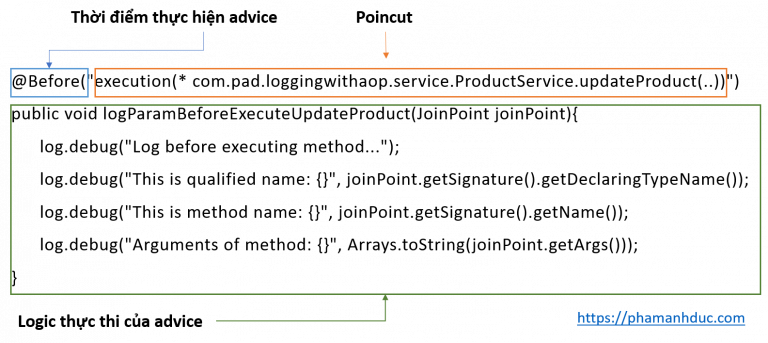
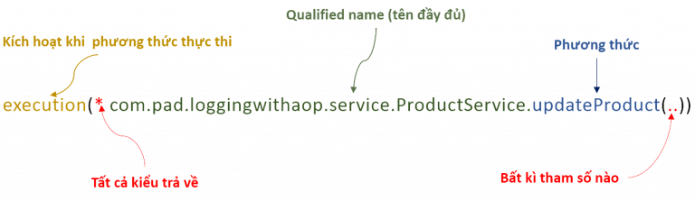

# Spring AOP ( Aspect-Oriented Programming)

## 1. AOP là gì?
Aspect Oriented Programming (AOP) là 1 kỹ thuật lập trình dùng để tách logic chương trình thành các phần riêng biệt…

Trong Spring AOP, có 4 loại advice được hỗ trợ:
- Before advice: chạy trước khi method được thực thi
- After returning advice: Chạy sau khi method trả về một kết quả
- After throwing adivce: Chạy khi method ném ra một exception
- Around advice: Chạy khi method được thực thi (Bao gồm cả 3 loại advice trên)

## 2. Trường hợp sử dụng
- logging
- security(access control,session management, input/output validation)
- transaction không làm phức tạp logic chính.
- error handling
## 3. Các thành phần chính của Spring AOP
- **Aspect**: là một class bao gồm các advice và các joint point.
- **Advice**: một hành động thực hiện ở joint point.
    + `Before advice`: chạy trước khi method được thực thi
    + `After returning advice`: Chạy sau khi method trả về một kết quả.
    + `After throwing adivce`: Chạy khi method ném ra một exception.
    + `After (finally) advice`
    + `Around advice`: Chạy khi method được thực thi (Bao gồm cả 3 loại advice trên)
    
- **Join Point**: à các điểm trong chương trình ví dụ điểm thực thi method (method execution), điểm xử lý excpetion, field access… Spring chỉ hỗ trợ method execution join point.
- **Pointcut**: là expression language giúp khớp nối với joint point
- **Target Object**: object sẽ được adviced.
- **Weaving**: là tiến trình nối các aspect với các object, types để tạo nên advised object.

## 4. Setup
VD Logging (_nguồn: https://phamanhduc.com/logging-voi-aop-trong-spring-boot_)
### a. Dependency
```xml
<dependency>
    <groupId>org.springframework.boot</groupId>
    <artifactId>spring-boot-starter-aop</artifactId>
</dependency>
```
### b. Tạo logging aspect
lớp định nghĩa các advice, pointcut liên quan đến việc ghi log

```java
@Aspect
@Component
public class LoggingAspect {
  // khai báo các advice, poincut ở đây

  @Before("execution(* com.pad.loggingwithaop.service.ProductService.updateProduct(..))")
  public void logParamBeforeExecuteUpdateProduct(JoinPoint joinPoint) {
    log.debug("Log before executing method...");
    log.debug("This is qualified name: {}", joinPoint.getSignature().getDeclaringTypeName());
    log.debug("This is method name: {}", joinPoint.getSignature().getName());
    log.debug("Arguments of method: {}", Arrays.toString(joinPoint.getArgs()));
  }
}
```

Phân tích:



Tạo pointcut:



_Trong trường hợp muốn hạn chế các điểm joint point khớp với biểu thức, ta có thể sử dụng biểu thức && (và), || (hoặc), ! (phủ định) để kết xây dựng biểu thức. Biểu thức ở dưới đây có nghĩa, xác định các điểm join point là thực thi phương thức updateProduct() khi có lời gọi từ phương thức OrderController()._
```
execution(* com.pad.loggingwithaop.service.ProductService.updateProduct(..)) && within(com.pad.loggingwithaop.controller.OrderController)
```
hoặc định nghĩa 1 pointcut để tái sử dụng
```java
    @Pointcut("execution(* com.pad.loggingwithaop.service.ProductService.getProductById(..))")
    public void getProductById(){}

    @Before(value = "getProductById()")
    public void beforeGetProductById(JoinPoint joinPoint){
        log.debug("Get product with id {}", joinPoint.getArgs());
    }
    @AfterReturning(value = "getProductById()", returning = "result")
    public void afterReturnGetProductById(JoinPoint joinPoint, ResponseDTO result){
        log.debug("Value of product {} : {}", joinPoint.getArgs(), result);
    }
```
full ex:
```java
package com.pad.loggingwithaop.aspect;

import com.pad.loggingwithaop.model.Product;
import com.pad.loggingwithaop.payload.ResponseDTO;
import org.aspectj.lang.JoinPoint;
import org.aspectj.lang.ProceedingJoinPoint;
import org.aspectj.lang.annotation.*;
import org.slf4j.Logger;
import org.slf4j.LoggerFactory;
import org.springframework.stereotype.Component;

import java.util.Arrays;

@Aspect
@Component
public class LoggingAspect {
    private final Logger log = LoggerFactory.getLogger(this.getClass());

    @Before("execution(* com.pad.loggingwithaop.service.ProductService.updateProduct(..)) && within(com.pad.loggingwithaop.repository.*)")
    public void logParamBeforeExecuteUpdateProduct(JoinPoint joinPoint){
        log.debug("Log before executing method...");
        log.debug("This is qualified name: {}", joinPoint.getSignature().getDeclaringTypeName());
        log.debug("This is method name: {}", joinPoint.getSignature().getName());
        log.debug("Arguments of method: {}", Arrays.toString(joinPoint.getArgs()));
    }

    @Pointcut("execution(* com.pad.loggingwithaop.service.ProductService.getProductById(..))")
    public void getProductById(){}

    @Before(value = "getProductById()")
    public void beforeGetProductById(JoinPoint joinPoint){
        log.debug("Get product with id {}", joinPoint.getArgs());
    }

    @AfterReturning(value = "getProductById()", returning = "result")
    public void afterReturnGetProductById(JoinPoint joinPoint, ResponseDTO result){
        log.debug("Value of product {} : {}", joinPoint.getArgs(), result);
    }

    @AfterThrowing(value = "getProductById()")
    public void handleGetProductByIdException(JoinPoint joinPoint){
        log.debug("Can not find product with id: {}", joinPoint.getArgs());
    }

    @Around("execution(* com.pad.loggingwithaop.service.ProductService.deleteProduct(..))")
    public void logAfterDeleteProduct(ProceedingJoinPoint joinPoint) throws Throwable{
        try{
            joinPoint.proceed();
            log.debug("Delete product {} successfully", joinPoint.getArgs());
        }
        catch (Exception e){
            log.debug("Can not find product with id: {}", joinPoint.getArgs());
            throw e;
        }
    }

}
```