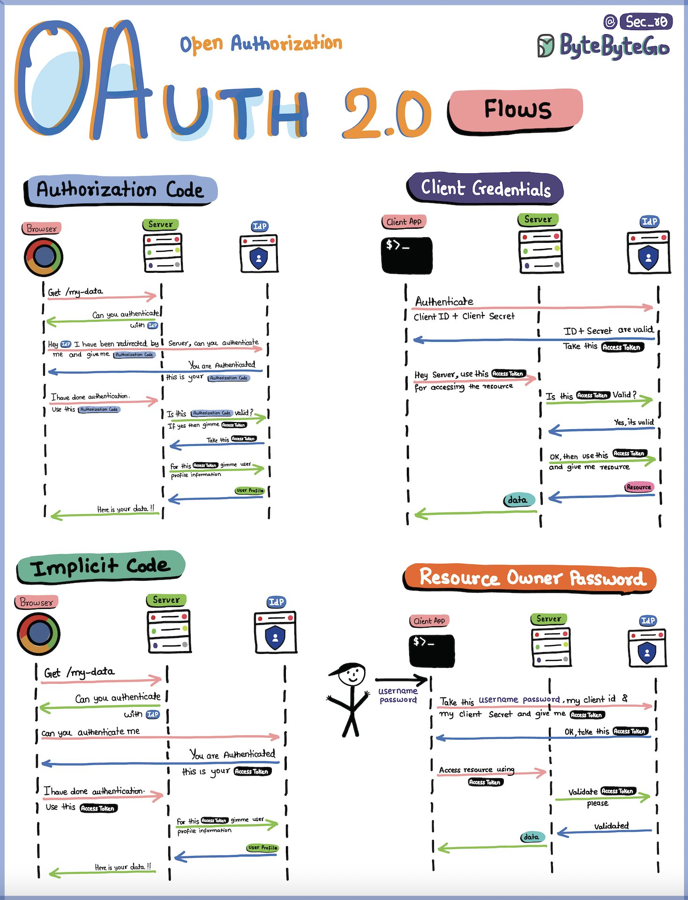
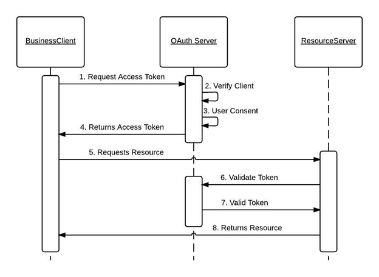

# OAuth

### I. Basic

#### 1. What is OAuth2?

- Khái niệm OAuth2:

    
    + `Resource Owner`:
    + `Authorization Server`:
    + `Resource Server`:
- Grant Types:
- Flows: 
    + `Authorization Code Flow`
    + `Implicit Flow`
    + `Resource Owner Password Credentials`
    + `Client Credentials`

#### 2. Config

##### a. Dependency

```xml
<dependency>
    <groupId>org.springframework.boot</groupId>
    <artifactId>spring-boot-starter-oauth2-client</artifactId>
</dependency>
```

##### b.`application.yml`
```yaml
spring:
  security:
    oauth2:
      client:
        registration:
          github:
            client-id: <github-client-id>
            client-secret: <github-client-secret>
            redirect-uri: "{baseUrl}/login/oauth2/code/github"
            scope: user
          google:
            client-id: <google-client-id>
            client-secret: <google-client-secret>
            redirect-uri: "{baseUrl}/login/oauth2/code/google"
            scope: profile, email
          facebook:
            client-id: <facebook-client-id>
            client-secret: <facebook-client-secret>
            redirect-uri: "{baseUrl}/login/oauth2/code/facebook"
            scope: public_profile, email
        provider:
          github:
            authorization-uri: https://github.com/login/oauth/authorize
            token-uri: https://github.com/login/oauth/access_token
            user-info-uri: https://api.github.com/user
          google:
            authorization-uri: https://accounts.google.com/o/oauth2/auth
            token-uri: https://oauth2.googleapis.com/token
            user-info-uri: https://www.googleapis.com/oauth2/v3/userinfo
          facebook:
            authorization-uri: https://www.facebook.com/v10.0/dialog/oauth
            token-uri: https://graph.facebook.com/v10.0/oauth/access_token
            user-info-uri: https://graph.facebook.com/me?fields=id,name,email
```

#### 3. Demo
[demo](/spring-oauth)