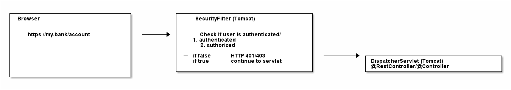
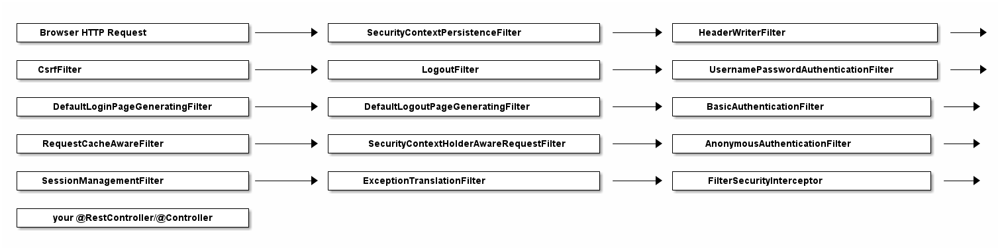

Ref : https://techmaster.vn/posts/36295/spring-security-ban-sau-ve-authentication-va-authorization-p1
# Spring Security

Spring Security thực sự chỉ là một loạt các bộ lọc servlet giúp bạn thêm authentication và authorization vào ứng dụng web của mình.

Nó cũng tích hợp tốt với các framework như Spring Web MVC (hay Spring Boot ), cũng như với các tiêu chuẩn như OAuth2 hoặc SAML. Và nó tự động tạo các trang login / logout và bảo vệ chống lại các hành vi khai thác thông tin như CSRF.

# Security WebApplication

1. Authentication
2. Authorization
3. Filter Servlet

## 1. Authentication
## 2. Authorization
## 3. Filter Servlet

Về cơ bản bất kỳ ứng dụng web Spring nào cũng chỉ là một servlet:
DispatcherServlet cũ của Spring, giúp chuyển hướng các yêu cầu HTTP đến (ví dụ từ trình duyệt) đến @Controllers hoặc @RestControllers

Vấn đề là: Không có mật mã bảo mật nào được mã hóa trong DispatcherServlet đó. Để cho tối ưu, việc authentication và authorization nên được thực hiện trước khi một request truy cập vào @Controllers.

=> có thể đặt bộ lọc lên trước các servlet, tức là có thể viết SecurityFilter và cấu hình nó trong Tomcat (servlet container/ application server)  để lọc mọi request HTTP trước khi nó truy cập vào servlet.



```java
import javax.servlet.*;
import javax.servlet.http.HttpFilter;
import javax.servlet.http.HttpServletRequest;
import javax.servlet.http.HttpServletResponse;
import java.io.IOException;

public class SecurityServletFilter extends HttpFilter {

    @Override
    protected void doFilter(HttpServletRequest request, HttpServletResponse response, FilterChain chain) throws IOException, ServletException {

        UsernamePasswordToken token = extractUsernameAndPasswordFrom(request);  // (1)

        if (notAuthenticated(token)) {  // (2)
            // either no or wrong username/password
            // unfortunately the HTTP status code is called "unauthorized", instead of "unauthenticated"
            response.setStatus(HttpServletResponse.SC_UNAUTHORIZED); // HTTP 401.
            return;
        }

        if (notAuthorized(token, request)) { // (3)
            // you are logged in, but don<t have the proper rights
            response.setStatus(HttpServletResponse.SC_FORBIDDEN); // HTTP 403
            return;
        }

        // allow the HttpRequest to go to Spring<s DispatcherServlet
        // and @RestControllers/@Controllers.
        chain.doFilter(request, response); // (4)
    }

    private UsernamePasswordToken extractUsernameAndPasswordFrom(HttpServletRequest request) {
        // Either try and read in a Basic Auth HTTP Header, which comes in the form of user:password
        // Or try and find form login request parameters or POST bodies, i.e. "username=me" & "password="myPass"
        return checkVariousLoginOptions(request);
    }

    private boolean notAuthenticated(UsernamePasswordToken token) {
        // compare the token with what you have in your database...or in-memory...or in LDAP...
        return false;
    }

    private boolean notAuthorized(UsernamePasswordToken token, HttpServletRequest request) {
       // check if currently authenticated user has the permission/role to access this request<s /URI
       // e.g. /admin needs a ROLE_ADMIN , /callcenter needs ROLE_CALLCENTER, etc.
       return false;
    }
}
```

1. Đầu tiên, bộ lọc cần extract username/password từ request. Nó có thể thông qua Basic Auth Http Header, hoặc các field trong form, hoặc cookie, v.v.
2. Sau đó, bộ lọc cần xác thực bằng cách đối chiếu tổ hợp username/password đó với một thứ gì đó , chẳng hạn như database.
3. Sau khi authenticate thành công, bộ lọc cần kiểm tra user có được phép truy cập requested URI hay không.
4. Nếu request vẫn tồn tại sau tất cả các lần kiểm tra này, thì bộ lọc có thể cho phép request chuyển đến DispatcherServlet của bạn, tức là @Controllers.

### FilterChains
Xác minh trong thực tế: Trong khi code trên có thể hoạt động khi biên dịch, nó sớm hay muộn cũng dẫn đến một bộ lọc chất đầy hàng tấn code cho các cơ chế authentication và authorization khác nhau.

Trong thế giới thực, ta sẽ chia bộ lọc này thành nhiều bộ lọc, sau đó ta liên ket với nhau.

Ví dụ: một request HTTP sẽ…

1. Đầu tiên, đi qua LoginMethodFilter…

2. Sau đó, đi qua AuthenticationFilter…

3. Sau đó, chuyển qua AuthorizationFilter…

4. Cuối cùng, chạm vào servlet.

Khái niệm này được gọi là FilterChain

### FilterChain & Security Configuration DSL

Mặc định khởi động ứng dụng web của mình. Ta sẽ thấy thông báo sau:

```java
2020-02-25 10:24:27.875  INFO 11116 --- [           main] o.s.s.web.DefaultSecurityFilterChain     : Creating filter chain: any request, [org.springframework.security.web.context.request.async.WebAsyncManagerIntegrationFilter@46320c9a, org.springframework.security.web.context.SecurityContextPersistenceFilter@4d98e41b, org.springframework.security.web.header.HeaderWriterFilter@52bd9a27, org.springframework.security.web.csrf.CsrfFilter@51c65a43, org.springframework.security.web.authentication.logout.LogoutFilter@124d26ba, org.springframework.security.web.authentication.UsernamePasswordAuthenticationFilter@61e86192, org.springframework.security.web.authentication.ui.DefaultLoginPageGeneratingFilter@10980560, org.springframework.security.web.authentication.ui.DefaultLogoutPageGeneratingFilter@32256e68, org.springframework.security.web.authentication.www.BasicAuthenticationFilter@52d0f583, org.springframework.security.web.savedrequest.RequestCacheAwareFilter@5696c927, org.springframework.security.web.servletapi.SecurityContextHolderAwareRequestFilter@5f025000, org.springframework.security.web.authentication.AnonymousAuthenticationFilter@5e7abaf7, org.springframework.security.web.session.SessionManagementFilter@681c0ae6, org.springframework.security.web.access.ExceptionTranslationFilter@15639d09, org.springframework.security.web.access.intercept.FilterSecurityInterceptor@4f7be6c8]|
```

Nếu ta mở rộng một dòng đó thành một list, nó sẽ giống như Spring Security không chỉ cài đặt một bộ lọc, thay vào đó, nó cài đặt toàn bộ một filterchain bao gồm 15 (!) bộ lọc khác nhau.

Vì vậy, khi một HTTPRequest đến, nó sẽ đi qua tất cả 15 bộ lọc này, trước khi request cuối cùng truy cập vào @RestControllers. Thứ tự cũng quan trọng, bắt đầu từ trên cùng list đó và đi xuống đáy.



#### Phân tích FilterChain của Spring

Một số Filter:

- BasicAuthenticationFilter : Cố gắng tìm Basic Auth HTTP Header theo request và nếu tìm thấy, cố gắng xác thực người dùng bằng username và password của header.

- UsernamePasswordAuthenticationFilter : Cố gắng tìm tham số request username/password hay POST body và nếu được tìm thấy, cố gắng authenticate user bằng các giá trị đó.

- DefaultLoginPageGeneratingFilter : Tạo trang login cho bạn, nếu bạn không disable tính năng đó. Bộ lọc NÀY là lý do tại sao bạn nhận được trang đăng nhập mặc định khi bật Spring Security.

- DefaultLogoutPageGeneratingFilter : Tạo trang logout cho bạn, nếu bạn không disable tính năng đó.

- FilterSecurityInterceptor : Thực hiện authorization của bạn

_=> Những bộ lọc đó, phần lớn, chính là Spring Security. Không hơn, không kém. Chúng làm tất cả công việc. Những gì còn lại cho bạn là cấu hình cách chúng hoạt động, tức URL nào cần bảo vệ, URL nào cần bỏ qua và bảng cơ sở dữ liệu nào sẽ được sử dụng để authenticate._

### Cách cấu hình Spring Security: WebSecurityConfigurerAdapter

```java
@Configuration
@EnableWebSecurity // (1)
public class WebSecurityConfig extends WebSecurityConfigurerAdapter { // (1)

    @Override
    protected void configure(HttpSecurity http) throws Exception {  // (2)
        http
            .authorizeRequests()
                .antMatchers("/", "/home").permitAll() // (3)
                .anyRequest().authenticated() // (4)
                .and()
            .formLogin() // (5)
                .loginPage("/login") // (5)
                .permitAll()
                .and()
            .logout() // (6)
                .permitAll()
                .and()
            .httpBasic(); // (7)
    }
}
```

### Authentication với Spring Security

Khi nói đến authentication và Spring Security, ta có ba kịch bản sau:

- **Mặc định** : Bạn có thể truy cập (hashed) password của user, bởi vì bạn có thông tin chi tiết của mình (username, password) được lưu chẳng hạn trong một bảng database.

- **Ít phổ biến hơn** : Bạn không thể truy cập password (hashed) của user. Đây là trường hợp nếu user và password của bạn được lưu trữ ở một nơi khác, chẳng hạn như trong một sản phẩm quản lý danh tính của bên thứ ba cung cấp dịch vụ REST cho authentication. Hãy thử tìm hiểu: [Atlassian Crowd](https://www.atlassian.com/software/crowd).

- **Cũng phổ biến** : Bạn muốn sử dụng OAuth2 hoặc “Đăng nhập bằng Google / Twitter / v.v.” (OpenID), khả năng kết hợp với JWT. Sau đó, không có điều nào có thể áp dụng thì bạn nên chuyển thẳng đến phần OAuth2.

Lưu ý : Tùy thuộc vào bạn rơi vào kịch bản nào, bạn cần chỉ định các @Beans khác nhau để Spring Security hoạt động, nếu không bạn sẽ nhận được các exception khá khó hiểu (như NullPointerException nếu bạn quên chỉ định PasswordEncoder).

#### 1. UserDetailsService: Có quyền truy cập vào password của user
Trong trường hợp này, Spring Security cần bạn xác định hai bean để thiết lập và chạy authentication

1. Một UserDetailsService.

2. Một PasswordEncoder

Chỉ định một UserDetailsService đơn giản như sau:
```java
@Bean
public UserDetailsService userDetailsService() {
    return new MyDatabaseUserDetailsService(); // (1)
}

public class MyDatabaseUserDetailsService implements UserDetailsService {

    UserDetails loadUserByUsername(String username) throws UsernameNotFoundException { // (1)
        // 1. Load the user from the users table by username. If not found, throw UsernameNotFoundException.
        // 2. Convert/wrap the user to a UserDetails object and return it.
        return someUserDetails;
    }
}

public interface UserDetails extends Serializable { // (2)

    String getUsername();

    String getPassword();

    // <3> more methods:
    // isAccountNonExpired,isAccountNonLocked,
    // isCredentialsNonExpired,isEnabled
}
```
#### Các Implementation sẵn có
Một lưu ý nhỏ: Bạn luôn có thể tự mình triển khai các interface UserDetailsService và UserDetails.

Tuy nhiên, bạn cũng có thể thay thế bằng các implementations có sẵn của Spring Security mà bạn có thể sử dụng/configure/extend/override.

- JdbcUserDetailsManager, là một UserDetailsService dựa trên JDBC (database). Bạn có thể cấu hình nó để khớp với cấu trúc bảng/cột user của mình .

- InMemoryUserDetailsManager , giữ tất cả các chi tiết user in-memory và rất tốt cho việc test.

- org.springframework.security.core.userdetail.User, là một implementation UserDetails mặc định, hợp lý mà bạn có thể sử dụng. Điều đó có nghĩa là có khả năng ánh xạ/sao chép giữa các entity/ bảng database của bạn và class User này. Ngoài ra, bạn có thể chỉ cần làm cho các entity của mình implement interface UserDetails.


#### PasswordEncoders

```java
@Bean
public BCryptPasswordEncoder bCryptPasswordEncoder() {
    return new BCryptPasswordEncoder();
}
```