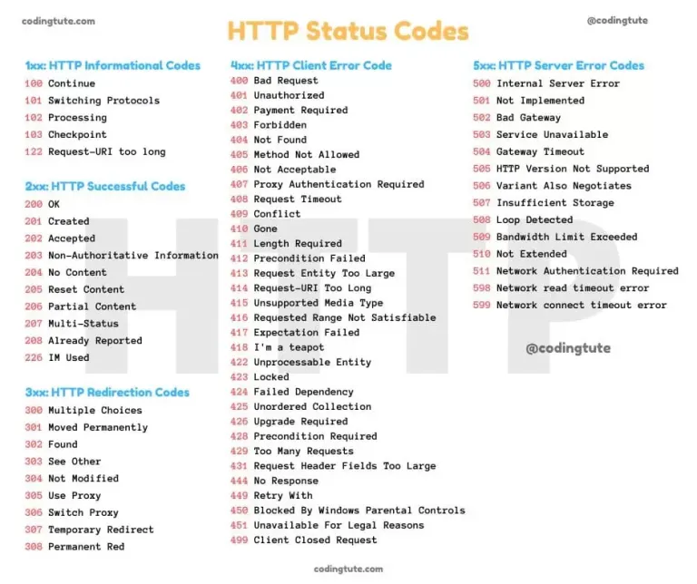

# I. RESTful API
_Restful API(Representational State Tranfer) is an architecture style for developing applications that can be accessed over the network using [HTTP](#1-http-) methods(GET, POST, PUT, DELETE). It usually responds to data types like JSON and XML._

### 1. HTTP 

_HTTP(Hyper Text Transfer Protocol) is the protocol for communication between web clients and servers._

#### a. History
#### b. Methods
- **GET**
- **POST**
- **PUT**
- **PATCH**
- **DELETE**
- **HEAD** : _Similar to GET but retrieves only the response headers, useful for checking resource properties without transferring the full content._

ex: 
```json
{'Content-Type': 'text/html; charset=UTF-8', 'Content-Length': '1256', 'Connection': 'keep-alive', 'Date': 'Thu, 24 Oct 2024 07:55:00 GMT'}
```
- **OPTIONS** : _retrieve the communication options available for a resource, including supported methods and headers._

ex: response 
```shell
HTTP/1.1 204 No Content
Allow: GET, POST, OPTIONS
```
- **TRACE** : _Used for debugging purposes to echo the received request back to the client, though it’s rarely used due to security concerns._

- **CONNECT** : _Used to establish a tunnel to the server through an HTTP proxy, commonly used for SSL/TLS connections._

#### c. HTTP Status Code
