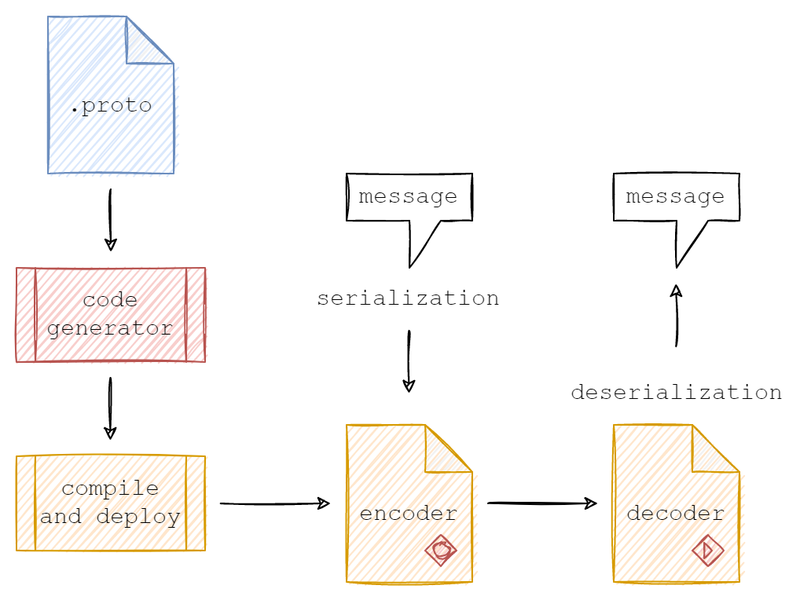
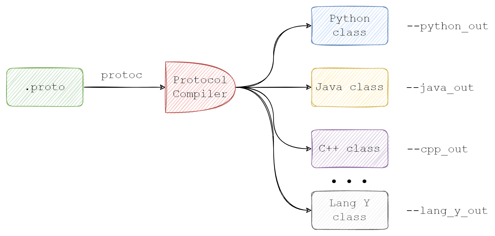
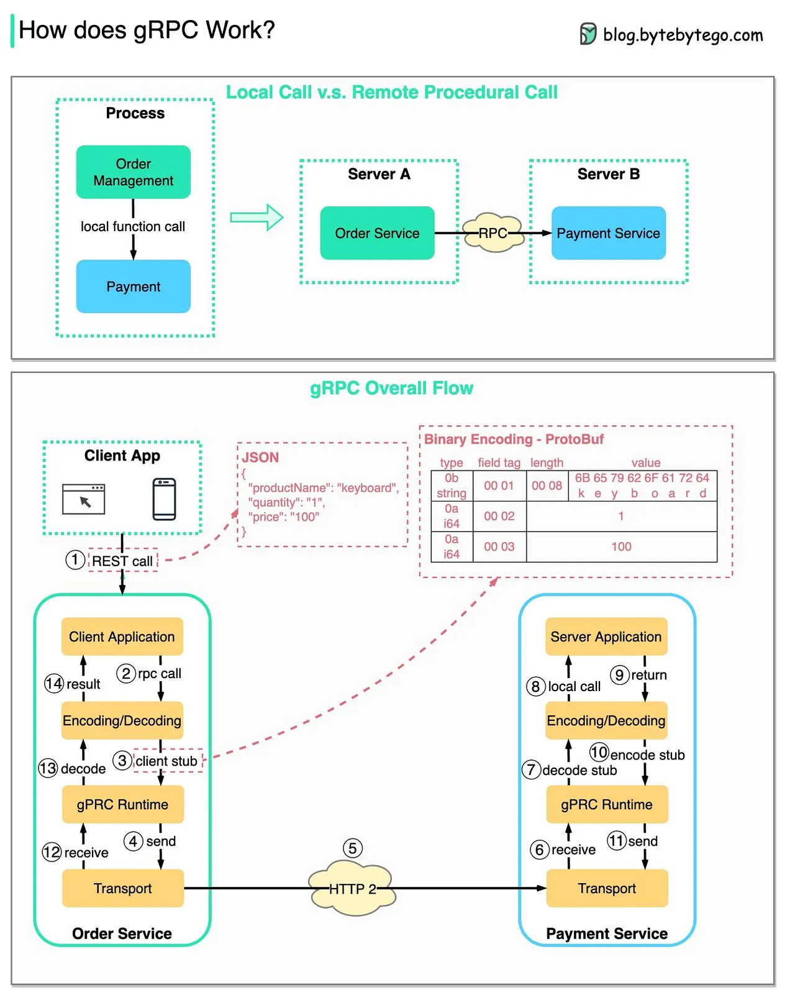

## 1️⃣ Basic

**🔹 1.1 Protocol Buffers (protobuf)**

_là một format tuần tự hóa dữ liệu (serialization format) do Google phát triển. Nó tối ưu hóa việc truyền và lưu trữ dữ liệu có cấu trúc, giúp giao tiếp giữa các hệ thống hiệu quả hơn so với JSON và XML._



✅ Cách định nghĩa một file `example.proto`
```protobuf
syntax = "proto3";

package example;

message User {
  string name = 1;
  int32 age = 2;
}
```
 Các kiểu dữ liệu trong Protobuf (string, int32, enum, message...)



compile
```
protoc --java_out=. example.proto
```

⚡ **So sánh `Protocol Buffers` vs `JSON` vs `XML`**

|Đặc điểm| 	Protocol Buffers (Protobuf)	 | JSON               |	XML|
|:--|:------------------------------|:-------------------|:--|
|Định dạng| 	Nhị phân (Binary) 🏎️	       | Văn bản (Text) 📜	 |Văn bản (Text) 📜|
|Tốc độ| 	Nhanh ⚡                      | 	Chậm hơn 🐢	      |Chậm nhất 🐌|
|Kích thước| 	Nhỏ 🗜️| 	Lớn hơn 📂        | 	Lớn nhất 🏋️      |
|Tính dễ đọc| 	Khó đọc 🧐                   | 	Dễ đọc 👀         |	Dễ đọc 👀| 
|Hỗ trợ schema| 	Có 📄	                       | Không ❌	           |Có 📄|

🔹 **1.2 Networking & API**

gRPC là một RPC framework:

- ✅ HTTP/2 (gRPC sử dụng HTTP/2 thay vì HTTP/1.1 như REST)
- ✅ Các phương thức gọi API: Unary, Streaming, Bidirectional
- ✅ Sự khác nhau giữa REST API vs RPC API

📌 **So sánh REST vs gRPC**

<style>
  table th {
    background-color: #00ccff;
    color: black;
  }
</style>

|Tiêu chí|	REST API|	gRPC|
|:--|:---|:--|
|Protocol|	HTTP/1.1|	HTTP/2|
|Data Format|	JSON, XML	|Protobuf (binary)
|Speed|	Chậm hơn|	Nhanh hơn|
|Streaming|	Không hỗ trợ tốt	|Hỗ trợ tốt|
|Codegen|	Không có	|Tự động sinh code|

## 2️⃣ gRPC core

🔹 2.1 Cách hoạt động của gRPC



_Khi một Client gọi một RPC, dữ liệu sẽ trải qua các bước sau:_

- 🔁 Chu trình gọi gRPC
- 1️⃣ Client gửi request (Protocol Buffers).
- 2️⃣ Server nhận request, xử lý và trả về response.
- 3️⃣ Dữ liệu được serial hóa bằng protobuf.
- 4️⃣ Truyền dữ liệu qua HTTP/2 (Multiplexing, Header Compression).
- 5️⃣ Client nhận response, deserialize và hiển thị kết quả.


- gRPC sử dụng protobuf để định nghĩa service

- Dữ liệu được mã hóa thành binary để truyền qua HTTP/2

- gRPC hỗ trợ các kiểu gọi: 
  + ✅ Unary RPC (1 request - 1 response)
  + ✅ Server streaming (1 request - nhiều response)
  + ✅ Client streaming (nhiều request - 1 response)
  + ✅ Bidirectional streaming (nhiều request - nhiều response)

🔹 2.2 Cách triển khai gRPC

📌 Ví dụ file user.proto:
```protobuf
syntax = "proto3";

package user;

service UserService {
rpc GetUser (UserRequest) returns (UserResponse);
}

message UserRequest {
string userId = 1;
}

message UserResponse {
string name = 1;
int32 age = 2;
}
```

👉 Sau đó dùng protoc để biên dịch file .proto thành mã nguồn.

🔹 2.3 Cách viết Server & Client gRPC
Bạn cần biết cách viết server và client để gọi gRPC.

📌 Viết gRPC Server trong Java (Spring Boot)

```java
@GrpcService
public class UserServiceImpl extends UserServiceGrpc.UserServiceImplBase {
    @Override
    public void getUser(UserRequest request, StreamObserver<UserResponse> responseObserver) {
        UserResponse response = UserResponse.newBuilder()
            .setName("John Doe")
            .setAge(25)
            .build();
        responseObserver.onNext(response);
        responseObserver.onCompleted();
    }
}
```
📌 Viết gRPC Client

```java
ManagedChannel channel = ManagedChannelBuilder.forAddress("localhost", 9090).usePlaintext().build();
UserServiceGrpc.UserServiceBlockingStub stub = UserServiceGrpc.newBlockingStub(channel);
UserResponse response = stub.getUser(UserRequest.newBuilder().setUserId("123").build());
System.out.println("User: " + response.getName());
```

🚀 **Xử lý lỗi trong gRPC (Error Handling)**

[_Error Handling_](src/main/resources/static/ErrorHandling.md)

## 3️⃣ Kiến thức nâng cao

🔹 3.1 Bảo mật & Authentication
- Dùng TLS trong gRPC

- Xác thực bằng JWT / OAuth2

- API Gateway cho gRPC (Envoy Proxy, gRPC-Web)

🔹 3.2 Triển khai gRPC trong thực tế
- Triển khai gRPC với Docker

- Monitor gRPC với Prometheus & Grafana

- gRPC Load Balancing
