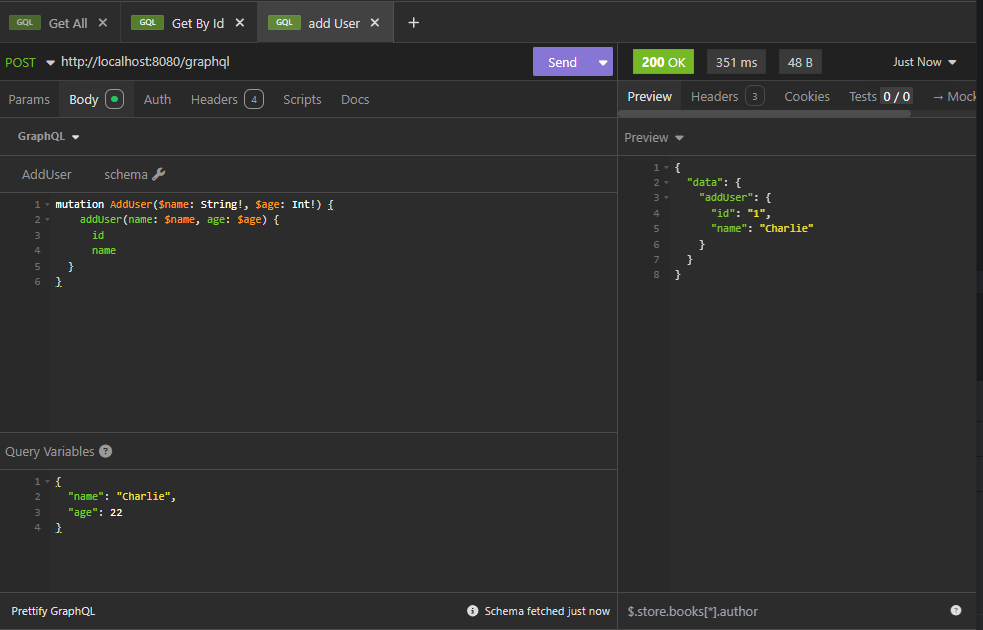

## 1. GraphQL là gì?
   GraphQL là một API query language do Facebook phát triển, thay thế REST API bằng cách:
-  ✅ Client có thể lấy đúng dữ liệu cần thiết (không thừa, không thiếu).
-  ✅ Hỗ trợ multiple queries trong một request.
-  ✅ Giảm số lần request (n+1 vấn đề của REST).
-  ✅ Có schema mạnh mẽ, dễ dàng phát triển & kiểm tra API.

<style>
  table th {
    background-color: #00ccff;
    color: black;
  }
</style>

🔍 So sánh GraphQL vs REST

| Tiêu chí         |	REST API|	GraphQL|
|:-----------------|:--|:--|
| Data Fetching    |	API trả về tất cả dữ liệu theo route cụ thể|	Chỉ lấy đúng dữ liệu cần thiết|
| Multiple Queries |	Nhiều requests đến các endpoint khác nhau|	Một request có thể lấy nhiều dữ liệu|
| Versioning       |	Thường có v1, v2,...	|Không cần versioning (schema có thể mở rộng)|
| Performance      |	Gửi nhiều request|	Một request duy nhất|
| Cách truy vấn    | nhiều endpoint(_/users, /posts, .._)| 1 endpoint duy nhất(_/graphql_)|
| Mutation         |Dùng `POST`, `PUT`, `DELETE`| Dùng `mutation` (giống POST)|

---

## Setup
### 1. Schema
- Xác định cấu trúc API và kiểu dữ liệu
- Vidu:
```text
type User {
  id: ID!
  name: String!
  age: Int!
}
```

### 2. Query
```text
type Query {
  getUser(id: ID!): User
}
```

### 3. Mutation
```text
type Mutation {
    addUser(name: String!, age: Int!): User
}
```
### 4. Subscription (Real-time update)
```text
type Subscription {
userAdded: User
}
```

_👉 Subscription yêu cầu WebSocket thay vì HTTP!_


---
## Test Example 

### 1. add User


### 2. get user by id


---
[↩ 🏠︎ Home : ̗̀➛](../../../../../../../List Contents.md)