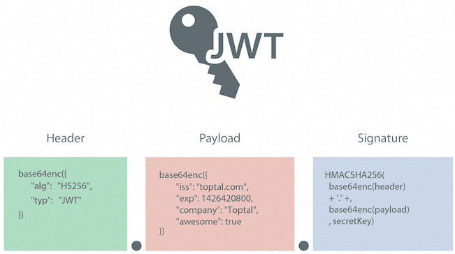
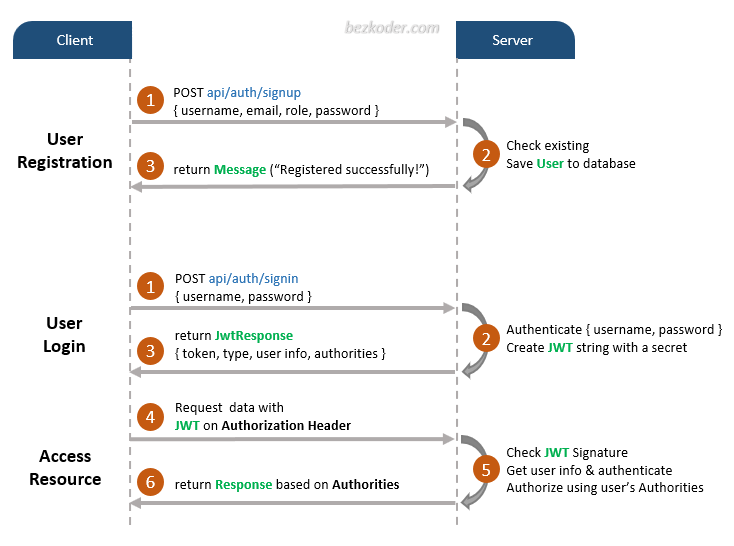
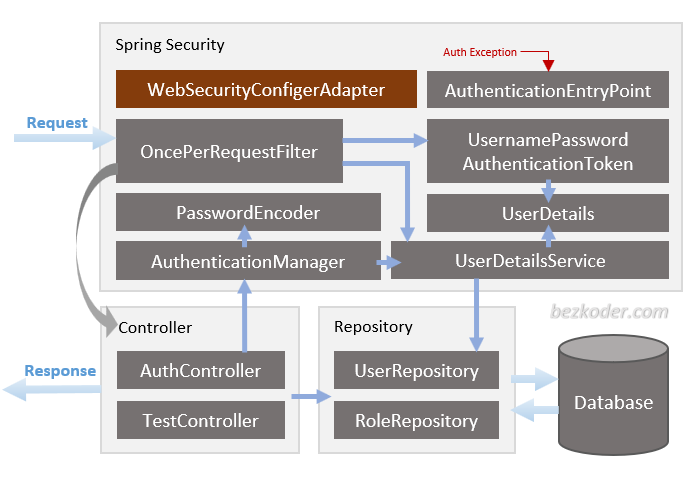
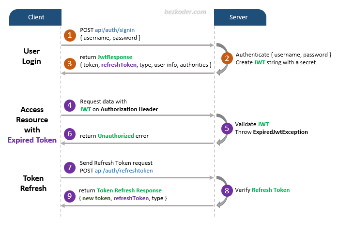

# Spring Security + Restful Api

Tech:
- Spring Web (RESTFUL)
- Spring Security
- Spring JPA + PostgresSQL
- JWT



_Flow process:_



_Architecture:_



### MỤC LỤC

1. [Dependencies](#i-dependencies-)
2. [Configuration](#ii-configuration)
3. [API-Docs](#iii-api-docs)
4. [Refresh Token](#iv-refresh-token)
5. [Authorization](#v-authorization)
6. [Reference](#vi-reference)

### I. Dependencies 
`pom.xml`
```xml
<!-- Spring Security -->
    <dependency>
        <groupId>org.springframework.boot</groupId>
        <artifactId>spring-boot-starter-security</artifactId>
    </dependency>
    <!-- JWT (Java Web Token) -->
    <dependency>
        <groupId>io.jsonwebtoken</groupId>
        <artifactId>jjwt-api</artifactId>
        <version>0.11.5</version>
    </dependency>
    <dependency>
        <groupId>io.jsonwebtoken</groupId>
        <artifactId>jjwt-impl</artifactId>
        <version>0.11.5</version>
    </dependency>
    <dependency>
        <groupId>io.jsonwebtoken</groupId>
        <artifactId>jjwt-jackson</artifactId>
        <version>0.11.5</version>
    </dependency>
```

### II. Configuration

1. Create class `JwtAuthenticationFilter`

```java
import jakarta.servlet.FilterChain;
import jakarta.servlet.ServletException;
import jakarta.servlet.http.HttpServletRequest;
import jakarta.servlet.http.HttpServletResponse;
import lombok.RequiredArgsConstructor;
import org.springframework.security.core.context.SecurityContextHolder;
import org.springframework.security.web.authentication.WebAuthenticationDetailsSource;
import org.springframework.stereotype.Component;
import org.springframework.web.filter.OncePerRequestFilter;

import java.io.IOException;

@Component
@RequiredArgsConstructor
public class JwtAuthenticationFilter extends OncePerRequestFilter {

    private final JwtService jwtService;
    private final UserDetailsService userDetailsService;

    @Override
    protected void doFilterInternal(HttpServletRequest request, HttpServletResponse response, FilterChain filterChain)
            throws ServletException, IOException {

        String authHeader = request.getHeader("Authorization");
        if (authHeader == null || !authHeader.startsWith("Bearer ")) {
            filterChain.doFilter(request, response);
            return;
        }

        String jwt = authHeader.substring(7);
        String username = jwtService.extractUsername(jwt);

        if (username != null && SecurityContextHolder.getContext().getAuthentication() == null) {
            var userDetails = this.userDetailsService.loadUserByUsername(username);
            if (jwtService.isTokenValid(jwt, userDetails)) {
                var authToken = new UsernamePasswordAuthenticationToken(
                        userDetails, null, userDetails.getAuthorities());
                authToken.setDetails(new WebAuthenticationDetailsSource().buildDetails(request));
                SecurityContextHolder.getContext().setAuthentication(authToken);
            }
        }
        filterChain.doFilter(request, response);
    }
}
```
2. create `JwtService`:
```java
import io.jsonwebtoken.Claims;
import io.jsonwebtoken.Jwts;
import io.jsonwebtoken.SignatureAlgorithm;
import org.springframework.beans.factory.annotation.Value;
import org.springframework.security.core.userdetails.UserDetails;
import org.springframework.stereotype.Service;

import java.util.Date;
import java.util.HashMap;
import java.util.Map;
import java.util.function.Function;

@Service
public class JwtService {

    @Value("${jwt.secret}")
    private String secretKey;

    public String extractUsername(String token) {
        return extractClaim(token, Claims::getSubject);
    }

    public <T> T extractClaim(String token, Function<Claims, T> claimsResolver) {
        final Claims claims = extractAllClaims(token);
        return claimsResolver.apply(claims);
    }

    private Claims extractAllClaims(String token) {
        return Jwts.parser().setSigningKey(secretKey).parseClaimsJws(token).getBody();
    }

    public Boolean isTokenValid(String token, UserDetails userDetails) {
        final String username = extractUsername(token);
        return (username.equals(userDetails.getUsername()) && !isTokenExpired(token));
    }

    private Boolean isTokenExpired(String token) {
        return extractExpiration(token).before(new Date());
    }

    private Date extractExpiration(String token) {
        return extractClaim(token, Claims::getExpiration);
    }

    public String generateToken(UserDetails userDetails) {
        return createToken(new HashMap<>(), userDetails.getUsername());
    }

    private String createToken(Map<String, Object> claims, String subject) {
        return Jwts.builder()
                .setClaims(claims)
                .setSubject(subject)
                .setIssuedAt(new Date(System.currentTimeMillis()))
                .setExpiration(new Date(System.currentTimeMillis() + 1000 * 60 * 60 * 10)) // 10 hours
                .signWith(SignatureAlgorithm.HS256, secretKey)
                .compact();
    }
}
```

3. `SecurityConfig`
```java
import org.springframework.context.annotation.Bean;
import org.springframework.context.annotation.Configuration;
import org.springframework.security.config.annotation.method.configuration.EnableMethodSecurity;
import org.springframework.security.config.annotation.web.builders.HttpSecurity;
import org.springframework.security.config.http.SessionCreationPolicy;
import org.springframework.security.web.SecurityFilterChain;
import org.springframework.security.web.authentication.UsernamePasswordAuthenticationFilter;

@Configuration
@EnableMethodSecurity // Kích hoạt bảo mật phương thức
public class SecurityConfig {

    private final JwtAuthenticationFilter jwtAuthenticationFilter;

    public SecurityConfig(JwtAuthenticationFilter jwtAuthenticationFilter) {
        this.jwtAuthenticationFilter = jwtAuthenticationFilter;
    }

    @Bean
    public SecurityFilterChain securityFilterChain(HttpSecurity http) throws Exception {
        http
            .csrf(csrf -> csrf.disable()) // Tắt CSRF vì API thường không yêu cầu
            .sessionManagement(session -> session
                .sessionCreationPolicy(SessionCreationPolicy.STATELESS)) // Không lưu session
            .authorizeHttpRequests(auth -> auth
                .requestMatchers("/api/auth/**").permitAll() // Cho phép truy cập công khai vào endpoint auth
                .anyRequest().authenticated()) // Tất cả các endpoint khác yêu cầu xác thực
            .addFilterBefore(jwtAuthenticationFilter, UsernamePasswordAuthenticationFilter.class); // Thêm filter JWT

        return http.build();
    }
}

```

### III. API-Docs

_Config:_
```xml
<!-- Swagger -->
<dependency>
    <groupId>org.springdoc</groupId>
    <artifactId>springdoc-openapi-starter-webmvc-ui</artifactId>
    <version>2.3.0</version>
</dependency>
```

- Swagger UI at http://localhost:8080/swagger-ui/index.html
- OpenAPI JSON documentation at http://localhost:8080/v3/api-docs

### IV. Refresh Token


### V. Authorization

### VI. Reference
1. ChatGPT
2. https://github.com/bezkoder/spring-boot-refresh-token-jwt


---
[↩ 🏠︎ Home : ̗̀➛](../../List Contents.md)